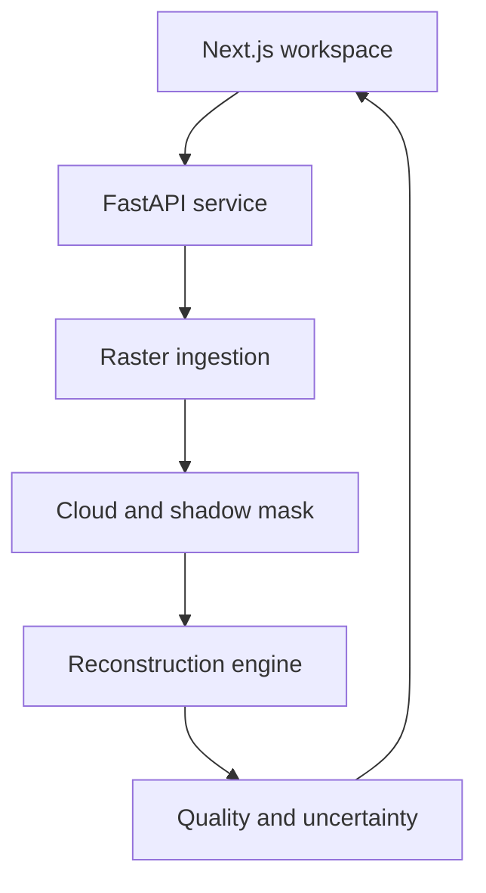
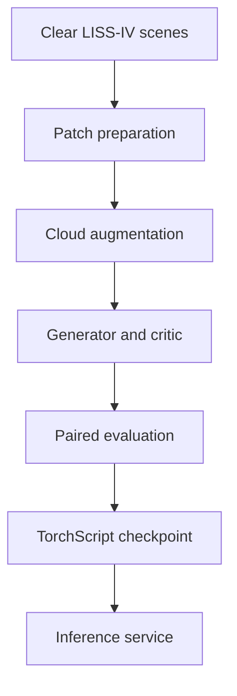

# System architecture

The repository separates the operator experience, geospatial preprocessing,
inference, and model-development workflows. This keeps the web application
lightweight and lets the inference service run locally, in a private network,
or next to accelerator hardware.



## Runtime flow

1. The web client sends a GeoTIFF or preview image as multipart form data.
2. The API validates size and type, reads raster bands, retains geospatial
   metadata, and normalizes reflectance per band.
3. The mask service estimates cloud probability from visible brightness,
   whiteness, vegetation contrast, texture, and scene-adaptive thresholds.
4. Adjacent dark pixels are evaluated as possible cloud shadows.
5. The reconstruction engine receives the normalized scene and combined mask.
6. The model predicts masked reflectance. Original values outside the mask are
   merged back exactly.
7. The service generates uncertainty, reference-free indicators, and preview
   images for the client.

## Model-development flow



## Components

| Component | Location | Responsibility |
|---|---|---|
| Operator workspace | `apps/web` | Upload, configure, compare, inspect, and export |
| HTTP service | `apps/api/app/main.py` | Lifecycle, CORS, health, and API composition |
| Raster adapter | `apps/api/app/services/raster_io.py` | GeoTIFF/image decoding, normalization, previews |
| Mask estimator | `apps/api/app/services/cloud_mask.py` | Cloud probability, morphology, and shadow evidence |
| Reconstruction | `apps/api/app/services/reconstruction.py` | Learned model adapter and deterministic baseline |
| Quality metrics | `apps/api/app/services/metrics.py` | Operational and paired-validation metrics |
| Generator | `ml/models/generator.py` | Gated mask-conditioned encoder-decoder |
| Data pipeline | `ml/data/dataset.py` | Patch loading, paired inputs, procedural cloud augmentation |
| Training | `ml/train.py` | Adversarial training, validation, checkpointing, export |

## Deployment modes

### Checkpoint-free demonstration

If `MODEL_PATH` is empty, the API runs the spectral-spatial baseline. This
mode makes ingestion, masking, metrics, previews, and the complete application
testable without trained weights. Responses explicitly report
`"mode": "baseline"`.

### Learned inference

Set `MODEL_PATH` to an exported TorchScript generator and install the API with
the `ml` extra:

```bash
pip install -e 'apps/api[ml]'
MODEL_PATH=checkpoints/generator.ts uvicorn app.main:app --app-dir apps/api
```

Responses then report `"mode": "learned"`. The service performs repeated
stochastic passes and uses their variance as an uncertainty signal.

## Security properties

- Input size is bounded before raster decoding.
- Supported file formats are allow-listed.
- CORS origins are configured explicitly.
- Containers run as unprivileged users.
- Model and dataset artifacts are excluded from version control.
- The inference service requires no external API or remote data transfer.

